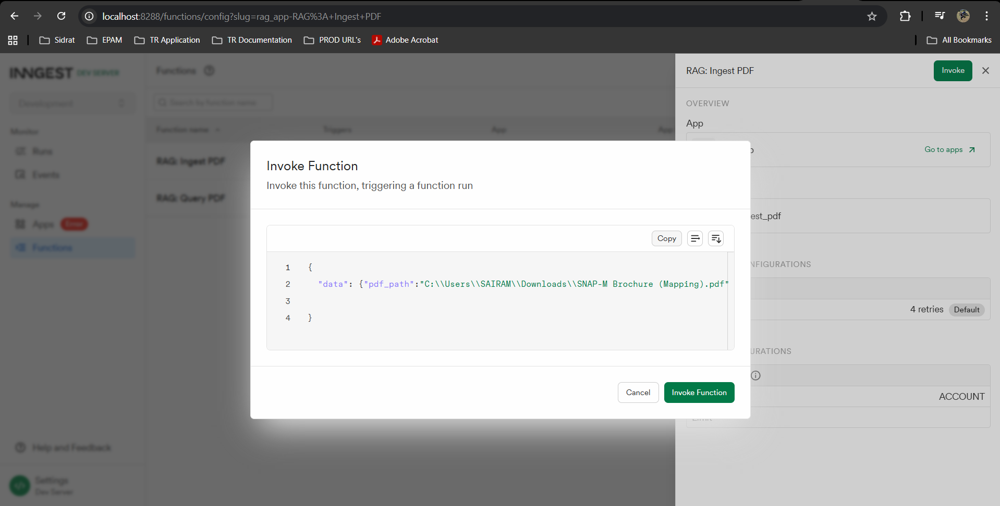
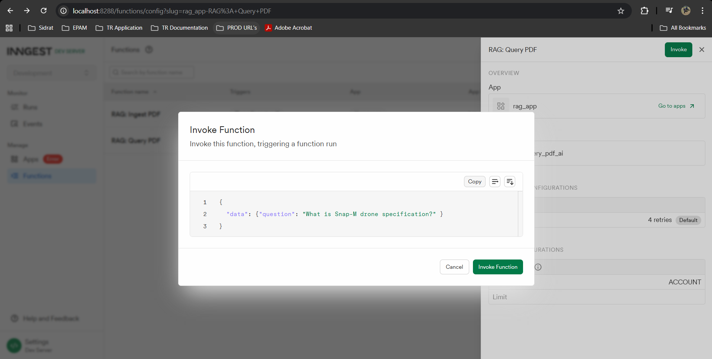
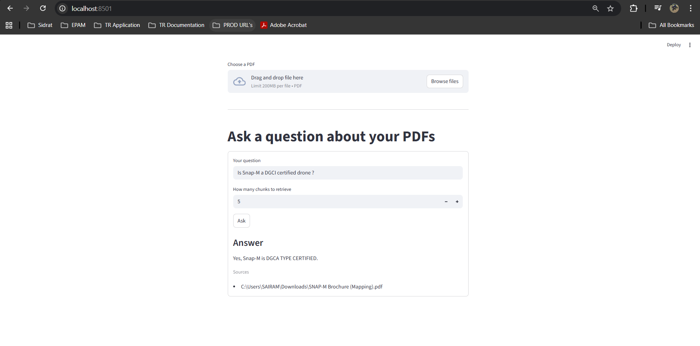

1. Create virtual isolated environement.
        python -m venv .venv
2. Resolve all the dependencies using pip.
        pip install . 
   Dependencies from pyproject.toml will be resolved.
3. Run Inngest server using ngx in a isolated command window (Node is prerequisite for this step)
        npx inngest-cli@latest dev -u http://127.0.0.1:8000/api/inngest --no-discovery
4. Bring up Qdrant vector DB using docker.
        docker run -d --name qdrant -p 6333:6333 -v "./qdrant_storage:/qdrant/storage" qdrant/qdrant
5. Install UV to run python code using Uvicorn
        pip install uv uvicorn
6. Run the main app with uv
        uv run uvicorn main:app
7. We can test the application using Inngest dashboad. Alternatively we can have our own customized UI using steamlit. Run below command to bring up steamlit UI
        uv run streamlit run ./streamlit_app.py

Inngest Dashboard URL : http://localhost:8288/runs
Streamlit UI: http://localhost:8501/

Sample Request:
{
  "data": {"pdf_path":"C:\\Users\\SAIRAM\\Downloads\\SNAP-M Brochure (Mapping).pdf" }
}

Response:
{
  "ingested": 5
}

Sample Request:
{
  "data": {"question": "What is Snap-M drone specification?" }
}

Response: 
{
  "choices": [
    {
      "finish_reason": "stop",
      "index": 0,
      "logprobs": null,
      "message": {
        "annotations": [],
        "content": "The Snap-M drone specifications are as follows:\n\n- Endurance: 55 mins\n- Wind Resistance: >8 m/s\n- Flight Speed: 10+ m/s\n- Weight: >2 kg\n- Low Battery: <10 cm\n- Communication Loss: <20 cm\n- Geofence Breach: Accuracy X/Y: 3 cm at 120m AGL\n- Accuracy Z: 1cm + 1 ppm CEP\n- Return to Home (Failsafe Features)\n- Wireless Security: AES 128-bit Encryption\n- Wireless Range: 4+ km\n- Battery: Li-Ion (<100Wh Packs)\n- Camera: >20MP, Sony sensor, CMOS\n- Storage: Expandable SD card up to 16GB\n- GNSS: L1 & L2, G1 & G2 (GPS, GLONASS, Galileo)\n- Logging Rate: 10 Hz\n- Side Overlap: 60%\n- Compliance: DGCA TYPE CERTIFIED",
        "refusal": null,
        "role": "assistant"
      }
    }
  ],
  "created": 1764396498,
  "id": "chatcmpl-Ch8PyDQnG4gJpxQB0tO54HVfnLBtI",
  "model": "gpt-4o-mini-2024-07-18",
  "object": "chat.completion",
  "service_tier": "default",
  "system_fingerprint": "fp_b547601dbd",
  "usage": {
    "completion_tokens": 204,
    "completion_tokens_details": {
      "accepted_prediction_tokens": 0,
      "audio_tokens": 0,
      "reasoning_tokens": 0,
      "rejected_prediction_tokens": 0
    },
    "prompt_tokens": 451,
    "prompt_tokens_details": {
      "audio_tokens": 0,
      "cached_tokens": 0
    },
    "total_tokens": 655
  }
}

StreamLit UI:

Inngest Documentation: https://www.inngest.com/docs/reference/python